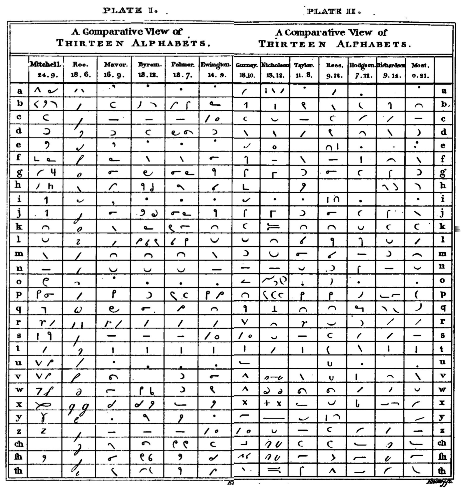

## Section 1
_On the analysis of the circle, and a comparative view of the above preceding systems, with this new system._

### Part 1

 p 14: Chopping up a circle with straight lines makes up every basic figure principle. (Shh, you ellipsoid lovers. It’s not your time yet. :gregg:) Mr Mitchell and friends say you can only get 9 signs out of this, but oh, those fools! I’ma get 20. That’s more than twice as awesome! We won’t need any pesky mixed or compounded characters with this huge symbol inventory.

Check out the first two plates, The Losers and Moat’s Awesomeness. No twirls. No angles. Just them sweet, sweet curves. (Or sections of a circle. I put some sections in this section for you.)

## Part 2: On the characters for the consonants

pp 15-16: Behold the many-lined circle! Therein lies the whole of our alphabet. Mostly.

I’m now going to painfully walk you through cutting it up into bits for the letters. You’ll have to keep referring to the points on the circle to work out stroke direction, because I can’t be bothered to draw in a couple arrows or something. But we get more than enough letters and get to spare some for th and qw. Then pitch in semi-elyptic hooked-ish lines for sh and ch. (That’s the “almost.”)

And I know what you’re gonna say: these all look the same! But that’s just your old-fashioned thinking and prejudice. The proof is in the pudding. Even a 12 year old could tell them all apart!

p 17: Look, I grouped the similar strokes for you. They’re easy to tell apart. There’s no way to accidentally a circle segment into a semicircle. It’s just math.

No “twirl” is needed: it’s not needed to tell apart, and not needed to join them. What, write _more_? As if that’s faster? Just one look at the plump, gaping … cold … haggle of them twirly systems, and you’ll come running to Daddy Moat for a _real_ system.

But you thought that was bad. It’s just redundant and wasteful. No, it’s the compound signs made with angles that just break the whole thing. You can’t write them without writing multiple simple characters. How are you gonna read that mess back?

Lemme give you an example from Mitchell/Gurney. All their vowel signs are compounds, like a = r + m.

p18: So “brave” looks so. But let’s make it easier and drop the vowel. Welp, it still could be brave, murmur, mar, and whatever the hell “brimmer” is. Hopeless.

So yeah. Symbols with angles are hopeless. The twirl is utterly unnecessary. Our simple signs are boss.

So how to assign them to characters? Frequency, ease of joining, and feels.

So your first job as a student is to matter accurately forming these 20 simple signs. Keep going till you can write them at a half second apiece (all 20, 3 times over, in just a minute). I’ll be waiting here when you’re ready to move on.